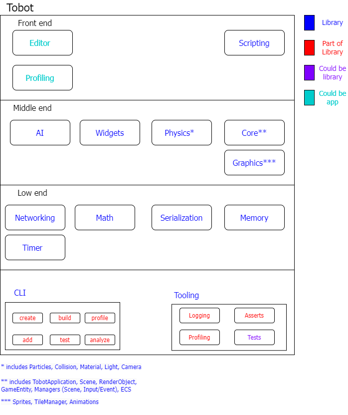

# Tobot Engine

> **NOTE**: 🚧 Under active development. 🚧

A simple game engine built on top of SDL2.

## Overview

Tobot is a simple game engine that is built on top of SDL2. It is designed to be simple and easy to use. The engine is written in C++ and provides an editor that was implemented using imgui.

## Architecture

## Key concepts

1. Creating a game should be approachable for beginners and intuitive
2. Programming in C and C++ sucks ass, so we provide another way for scripting that is more approachable

## License

This project is licensed under the [GNU General Public License](LICENSE)

## Dependencies

The engine has the following external dependencies

* SDL2
* SDL2_Image
* SDL2_Mixer
* SDL2_ttf
* Imgui

## Building from source

If you want to build tobot from source you need setup the following dependencies. At the moment this is the only way to try tobot, because there is no official release yet. To build it follow these [instructions](BuildFromSource.md).
