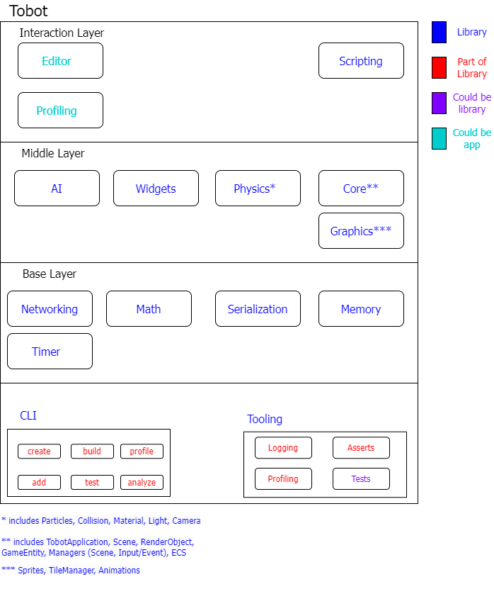

# Tobot Engine

> **NOTE**: 🚧 Under active development. 🚧

A simple game engine built on top of SDL2.

## Overview

## Architecture

## Key concepts

1. Creating a game should be approachable for beginners and intuitive
2. Programming in C and C++ sucks ass so we need to provide another way for scripting

## License

This project is licensed under the [GNU General Public License](LICENSE)

## Dependencies

## Under Windows

* psapi.h
* windows.h

### Under linux

* autoconf
* automake
* cmake
* libsdl2-dev
* libflac-dev
* libfluidsynth-dev
* libgme-dev
* libmpg123-dev
* libopusfile-dev
* libvorbis-dev
* libxmp-dev
* libwavpack-dev
* ninja-build
* pkg-config
* gFortran / Octave (I dont have a clue anymore - this is needed for choke, dunno what on earth that even :D)
